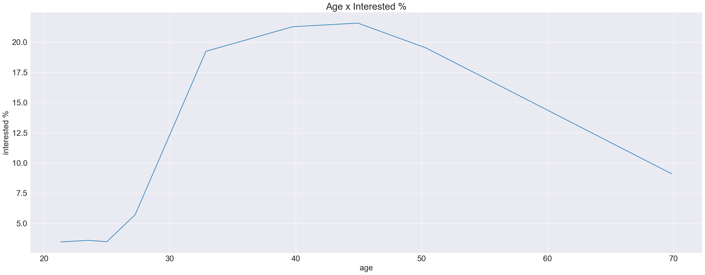
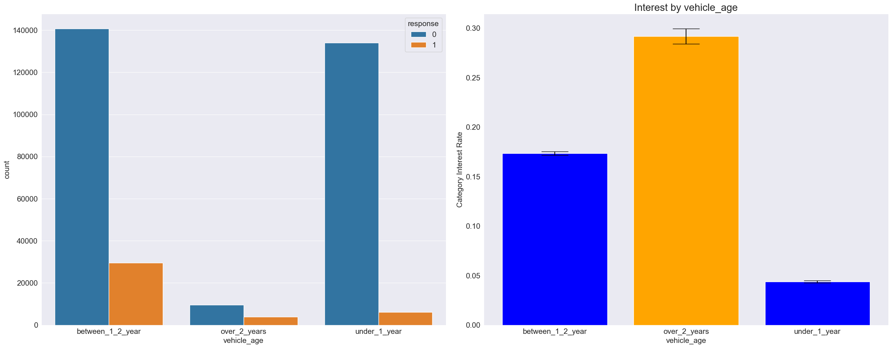
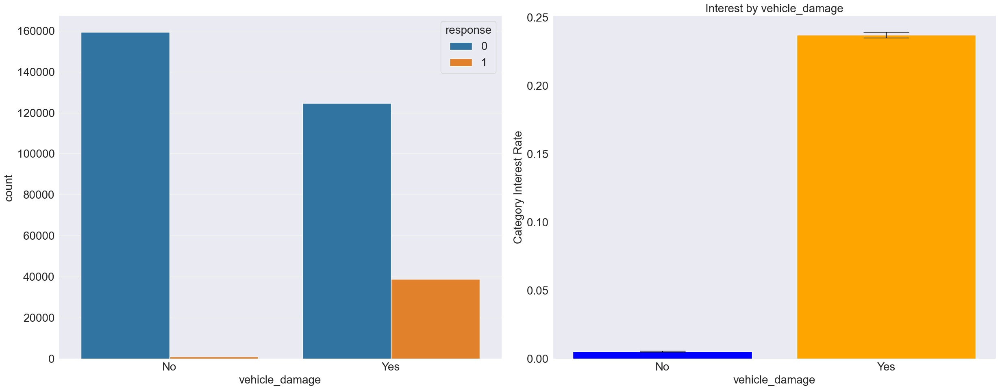
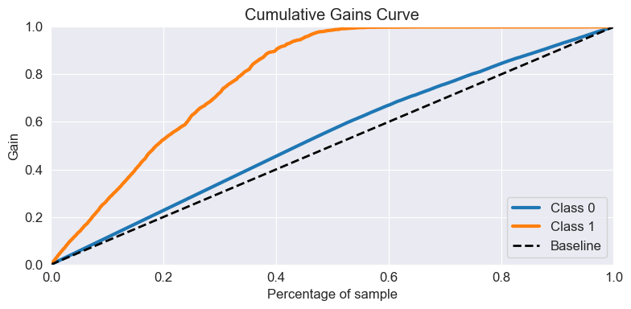
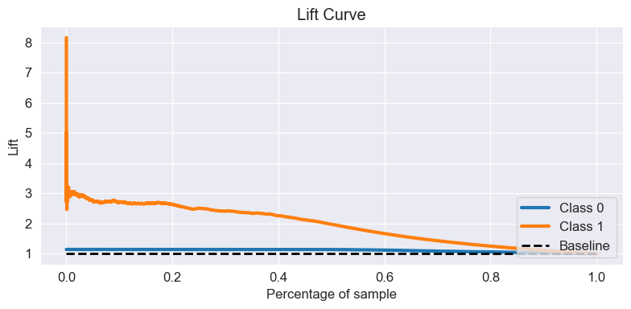
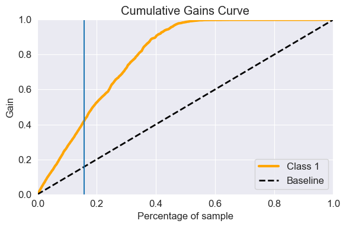
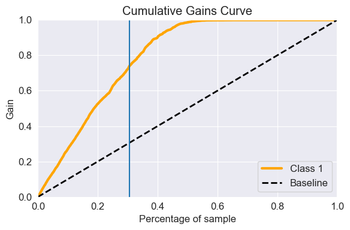
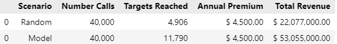

# Cross-Sell Vehicle Insurance Project

Disclaimer: The context of this project is totally fictitious.

## Summary

* [1.0. Business Problem](#1-business-problem)
* [2.0. Bussiness Assumptions](#20-business-assumptions)
    * [2.1. Data Dictionary](#21-data-dictionary)

* [3.0. Solution Strategy](#30-solution-strategy)

* [4.0. Top 3 Data Insights](#40-top-3-data-insights)
* [5.0. Machine Learning Model Applied](#50-machine-learning-model-applied)
    * [5.1. Evaluation Metrics](#51-evaluation-metrics)
    * [5.2. Evaluation Metrics](#52-models-performances---cross-validation)
* [6.0. Machine Learning Model Performance](#60-machine-learning-model-performance)
* [7.0. Business Results](#70-business-results)
    * [7.1. CEO Questions](#71-ceo-questions)
* [8.0. Conclusions](#80-conclusions)
* [9.0. Next Steps to Improve](#90-next-steps-to-improve)
* [10.0. Google Sheets demonstration](#100-google-sheets-demonstration)

# 1.0. Business Problem.

Insurance All is an insurance company that provides health insurance plans to its customers and is analyzing the possibility of offering a new product to them — vehicle insurance.

This new vehicle insurance plan will work like the health insurance plan. The customer has to pay an annual premium to Insurance All, and the company covers the expenses in an eventual automobile accident. 

Last year, the company surveyed 380,000 customers about their interest in acquiring a new product — vehicle insurance. The clients had to answer if they were or weren't interested in the vehicle insurance plan. Their answers and [attributes](#21-data-dictionary) were saved in a database.

Then, 127,037 new customers, who did not participate in the survey last year, were selected to participate in a campaign in which the company will offer them the vehicle insurance plan. The sales team will do it through phone calls. However, the sales team can only make 20,000 calls in the campaign period.

In this context, my challenge as a data science consultant is to design a solution that allows Insurance All to target customers more inclined to acquire vehicle insurance. So, the company can achieve the most profit from the 20,000 calls.

I will also need to deliver a report with the answers to the following questions:

1. What are the most interesting Insights about the most relevant attributes of the customers interested in acquiring vehicle insurance?

2. What is the percentage of clients interested in vehicle insurance that the sales team will be able to contact by making 20,000 calls?

3. If the sales team could make 40,000 calls, what percentage of interested customers would they be able to contact?

4. How many calls does the sales team need to contact 80% of the customers interested in acquiring vehicle insurance?
  

# 2.0. Business Assumptions.

- The vehicle insurance plan will cost $ 4,500 per year.

## 2.1. Data Dictionary
Feature|Description
--|--------------------------|
id|	Unique ID for the customer
Gender|	Gender of the customer
Age|	Age of the customer
Driving_License|	0 : Customer does not have DL, 1 : Customer already has DL
Region_Code|	Unique code for the region of the customer
Previously_Insured|	1 : Customer already has Vehicle Insurance, 0 : Customer doesn't have Vehicle Insurance
Vehicle_Age|	Age of the Vehicle
Vehicle_Damage|	1 : Customer got his/her vehicle damaged in the past. 0 : Customer didn't get his/her vehicle damaged in the past.
Annual_Premium|	The amount customer needs to pay as premium in the year
PolicySalesChannel|	Anonymized Code for the channel of outreaching to the customer ie. Different Agents, Over Mail, Over Phone, In Person, etc.
Vintage|	Number of Days the customer has been associated with the company
Response|	1 : Customer is interested, 0 : Customer is not interested
  

# 3.0. Solution Strategy

CRISP-DM method was used to develop this project.

My strategy to solve this challenge was:

**Step 00. Data Collection:** Collect the data from a Postgres database. Split the data into train and test.

**Step 01. Data Description:** Utilize descriptive statistics to gain an initial understanding of the dataset. Check the dimension of the data and inconsistencies - missing values, data types, and duplicates.

**Step 02. Feature Engineering:** Create a mind map of the Hypothesis, and make transformations in some features.

**Step 03. Data Filtering:** This step was not necessary.

**Step 04. Exploratory Data Analysis:** Univariate analysis of each variable with respect to the target variable. Bivariate analysis (Numerical x Numerical, Numerical x Categorical and Categorical x Categorial) in relation to the target variable. Multivariate analysis and hypothesis validation.

**Step 05. Data Preparation:** Defining the encoding methods for categorical variables and scaling methods for numerical variables.

**Step 06. Feature Selection:** Use boruta to select the most relevant features to fit the models.

**Step 07. Machine Learning Modelling:** Train five models using pipelines to prepare the data with the methods defined in step 05 and use only the variables selected in step 06. Analyze the performance of the models and choose the best one for the next step (fine-tuning).

**Step 08. Hyperparameter Fine Tuning:** Find the best parameters for the model selected in step 07 using cross-validation and optuna (hyperparameter optimization framework).

**Step 09. Model Results Analysis and Business Performance:** Evaluate the model's ability to adapt to previously unseen data drawn from the same distribution as the one used to create the model. Assess the business performance with the implementation of the final model.

**Step 10. Deploy Model to Production:** Create a Google Sheets script to request an API, with a click, that returns the propensity scores of the customers and sorts the list of customers in descending order based on the scores.
  

# 4.0. Top 3 Data Insights

**H1:** People in the age range of 40 to 47 have a higher propensity to acquire vehicle insurance.

 

**H2:** The percentage of people interested in vehicle insurance is higher among those with older cars.

 

**H3:** Almost none of the people who didn't have a problem with their vehicle in the past are interested in vehicle insurance.

 
  

# 5.0. Machine Learning Model Applied

For this project, different models were tested:

- Logistic Regression
- K-Nearest Neighbors
- LigthGBM Classifier
- ExtraTreesClassifier
- GaussianNB
  

## 5.1. Evaluation Metrics

The following metrics were used to evaluate the models: precision_at_20000, recall_at_20000, and lift_score.

precision_at_20000: this metric tells, in a list ordered by the score given by the model,  the percentage of interested customers in the first 20,000 (k) elements of the list.

recall_at_20000: this metric tells, of all interested customers, what percentage is in the first 20,000 elements of a list sorted by the score given by the model.

lift_score: measures how much better the model is compared to a random model. In our case, it tells us that we can expect to catch N(lift) times more interested customers using the model than we would by randomly targeting the same number of customers.
  

## 5.2. Models Performances - Cross-Validation

Model|precision_at_20000|recall_at_20000|lift_score
-----|--------------|-----------|----------
|LogisticRegression|0.1983 +/- 0.0002|0.9987 +/- 0.0009|2.0558 +/- 0.0196|
|KNN|0.1973 +/- 0.0004	|0.9937 +/- 0.0022| 2.2385 +/- 0.0261|
|**LGBM**|**0.1983 +/- 0.0001**|**0.999 +/- 0.0008**|**2.3005 +/- 0.0262**|
|ExtraTrees|0.195 +/- 0.0005|	0.9821 +/- 0.0023|2.2376 +/- 0.021|
|Gaussian|0.1981 +/- 0.0002|	0.9979 +/- 0.0009|2.3082 +/- 0.0309|
                                                             
# 6.0. Machine Learning Model Performance

From the previous results, the LGBMClassifier was chosen for hyperparameter fine-tuning. Then we re-trained the model using the train and validation sets and evaluated the model's generalization performance using the test set (previously unseen data).
  

Model|precision_at_20000|recall_at_20000|lift_score
-----|------------------|---------------|----------
LGBM Tuned|0.286636|0.818182|2.052952
  

# 7.0. Business Results

**Cumulative Gain Curve**

The curve above tells us that if we can contact 40% of the population (sorted by the propensity score), we can reach 90% of the customers who are interested in vehicle insurance.
  

**Lift Curve**

In the curve above, for 20% of the sorted data, we have a lift of almost 3. This means that, if we contact the top 20% of customers, we can expect to reach three times more interested customers than we would by contacting the same number of customers randomly.
  

## 7.1. CEO Questions

In the test set, we have 12.26% of interested customers. We assume the same proportion for the new clients (127,037) to answer the following questions:
  

### 1. What is the percentage of clients interested in vehicle insurance that the sales team will be able to contact by making 20,000 calls?

    With 20,000 calls, we can contact 15.75% of the 127,037 customers — ordered by the model's score — who did not participate in the survey. Then, we expect to reach 42% (6,541) of the customers interested in vehicle insurance.

    We expect to reach 15,75% (2453) of the interested customers if we contact 15.75% of the customers randomly.

  

The model is 2.66 times better than randomly targeting the customers. We expect 2.66 times more revenue using the model.
  

### 3. If the sales team could make 40,000 calls, what percentage of interested customers would they be able to contact?

    With 40,000 calls, we can contact 31.50% of the 127,037 customers — ordered by the model's score — who did not participate in the survey. Then, we expect to reach 75.70% (11,790) of the customers interested in vehicle insurance.

    We expect to reach 31.50% (4906) of the interested customers if we contact 31.50% of the customers randomly.

  

The model is 2.40 times better than randomly targeting the customers. We expect 2.40 times more revenue using the model.
  

### 4. How many calls does the sales team need to make to contact 80% of the customers interested in acquiring vehicle insurance?

    The sales team needs to make 43,107 calls to reach 80% of the customers interested in acquiring vehicle insurance.

    At random, 101,630 calls would be necessary to reach 80% of the interested customers.

# 8.0. Conclusions

The goals of the project were accomplished.
The company can prioritize the customers with higher probabilities of acquiring vehicle insurance with the solution developed in this project. This means that better results can be achieved with fewer resources.

With the implementation of the model, we reduce costs and increase revenue.
  

# 9.0. Next Steps to Improve

- Create new features to improve the model's performance.
- Test different encoding and scaling methods.

# 10.0. Google Sheets demonstration

  

#### This project was developed by Breno Teixeira.
